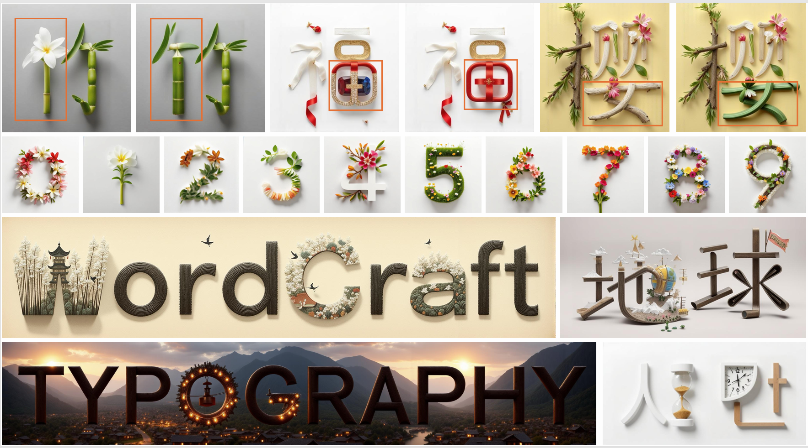
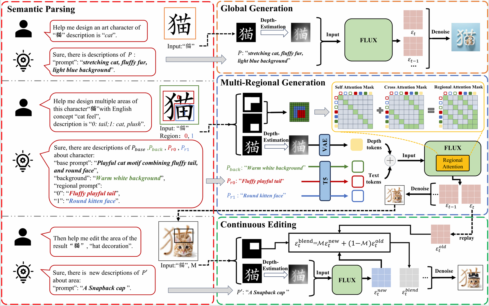

# WordCraft: Attention-Aware-Interactive-Artistic-Typography-with-Noise-Blending
<a href="https://arxiv.org/pdf/2507.09573"></a>
> This repository hosts the official PyTorch implementation of the paper: "**WordCraft: Attention-Aware-Interactive-Artistic-Typography-with-Noise-Blending**".

Our framework supports interactive generation, multi-region stylization, and continuous region editing.



Zhe Wang<sup>1</sup>,
Jingbo Zhang<sup>2</sup>,
Tianyi Wei<sup>3</sup>,
Wanchao Su<sup>4</sup>,
Can Wang<sup>5</sup>
<sup>1</sup>Jiangxi University of Finance and Economics, <sup>2</sup>Tencent Robotics X Lab, <sup>3</sup>Nanyang Technological University, <sup>4</sup>Monash University, <sup>5</sup>Hong Kong University

## News
**`2026.03.12`**:  Our testing code and pretrained model are released .

## Overview
<p align="center">An overview of the pipeline.

## Getting Started
### Prerequisites
```bash
torch>=2.0.0
torchvision
diffusers==0.30.2
transformers==4.43.3
accelerate==0.33.0
peft==0.12.0
huggingface_hub==0.24.6
Pillow
numpy
```
### Quick Start in Colab (Inference)
### 1.Multi-Regional Generation
``` shell
python SemTypo.py  
```
### 2.Continuous Editing
``` shell
python Editing.py  
```

## Acknowledgements
This code is based on [OminiControl](https://github.com/Yuanshi9815/OminiControl). The training code for custom weights can also be found in their repository.

## Citation

If you find our work useful for your research, please consider citing the following papers :)

```
@article{wang2026WordCraft,
  title={WordCraft: Attention-Aware-Interactive-Artistic-Typography-with-Noise-Blending},
  author={Wang, Zhe and Zhang, Jingbo and Wei, Tianyi and Su, Wanchao and Wang, Can},
  journal={arXiv preprint arXiv:2507.09573},
  year={2026}
}
```
